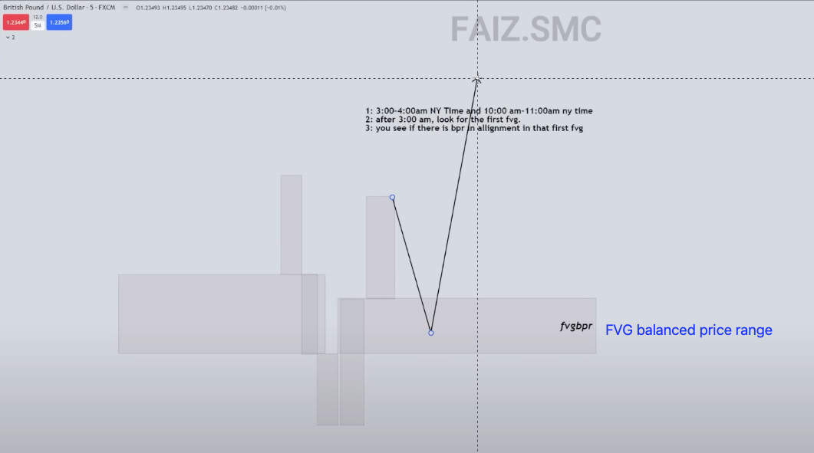

# ⚫ Faiz: ICT SB using BPR

Time: 3-4 am, 10-11 am EST

Instrument: EURUSD, NAS100, S\&P500

### FVG BPR

<figure><figcaption></figcaption></figure>

### BPR and first FVG (in SB killzone time)

<figure><figcaption></figcaption></figure>

In the above pic, first FVG in SB killzone time is bearish which aligns with bearish BPR, so we go Short (below pic).

<figure><figcaption></figcaption></figure>

### Youtube


